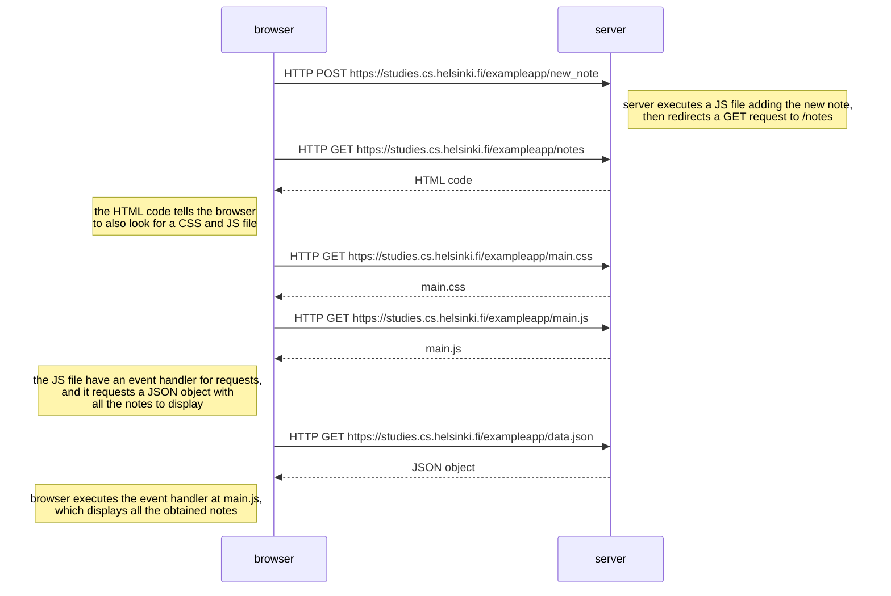

# Adding New Notes Diagram

```mermaid
sequenceDiagram
    participant browser
    participant server
    browser->>server: HTTP POST https://studies.cs.helsinki.fi/exampleapp/new_note
    Note right of server: server executes a JS file adding the new note,<br/>then redirects a GET request to /notes
    browser->>server: HTTP GET https://studies.cs.helsinki.fi/exampleapp/notes
    server-->>browser: HTML code
    Note left of browser: the HTML code tells the browser <br/> to also look for a CSS and JS file
    browser->>server: HTTP GET https://studies.cs.helsinki.fi/exampleapp/main.css
    server-->>browser: main.css
    browser->>server: HTTP GET https://studies.cs.helsinki.fi/exampleapp/main.js
    server-->>browser: main.js
    Note left of browser: the JS file have an event handler for requests, <br/> and it requests a JSON object with <br/> all the notes to display
    browser->>server: HTTP GET https://studies.cs.helsinki.fi/exampleapp/data.json
    server-->>browser: JSON object
    Note left of browser: browser executes the event handler at main.js, <br/> which displays all the obtained notes
```
