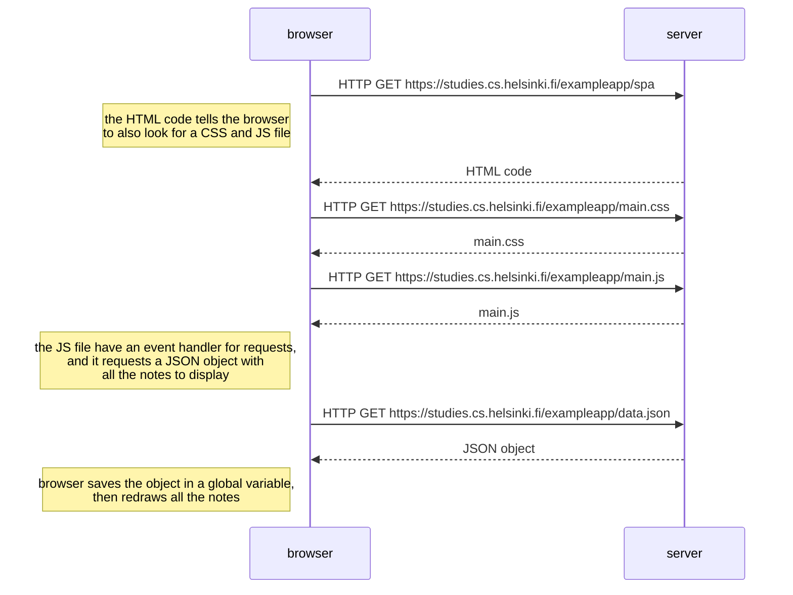

# SPA Notes Diagram

```mermaid
sequenceDiagram
    participant browser
    participant server
    browser->>server: HTTP GET https://studies.cs.helsinki.fi/exampleapp/spa
    Note left of browser: the HTML code tells the browser <br/> to also look for a CSS and JS file
    server-->>browser: HTML code
    browser->>server: HTTP GET https://studies.cs.helsinki.fi/exampleapp/main.css
    server-->>browser: main.css
    browser->>server: HTTP GET https://studies.cs.helsinki.fi/exampleapp/main.js
    server-->>browser: main.js
    Note left of browser: the JS file have an event handler for requests, <br/> and it requests a JSON object with <br/> all the notes to display
    browser->>server: HTTP GET https://studies.cs.helsinki.fi/exampleapp/data.json
    server-->>browser: JSON object
    Note left of browser: browser saves the object in a global variable, <br/> then redraws all the notes 
```
