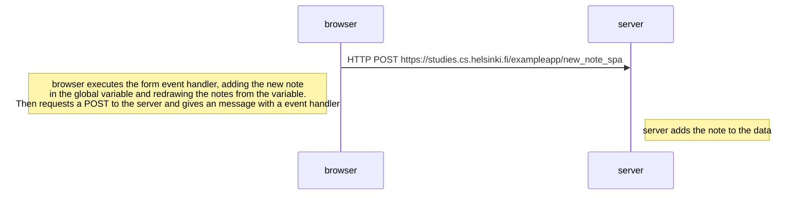

# SPA Adding New Notes Diagram

```mermaid
sequenceDiagram
    participant browser
    participant server
    browser->>server: HTTP POST https://studies.cs.helsinki.fi/exampleapp/new_note_spa
    Note left of browser: browser executes the form event handler, adding the new note<br/> in the global variable and redrawing the notes from the variable.  <br/>Then requests a POST to the server and gives an message with a event handler
    Note right of server: server adds the note to the data
```
